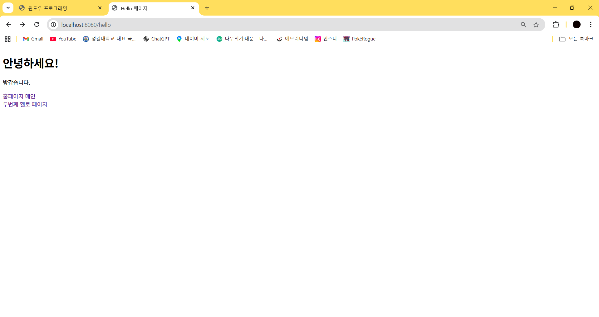
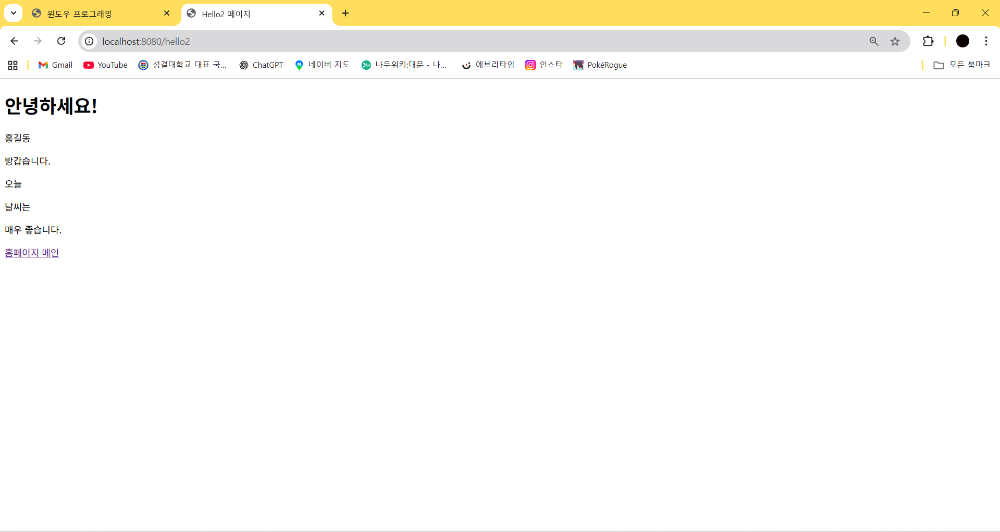

# 즐거운 웹애플리케이션!
2주차 수업 실습 환경 설정 완료.
-컨트롤러와 매핑 실습
-기본 HTML 페이지 연결
-/hello, /hello2 페이지 생성 및 데이터 출력 테스트

3주차 포트폴리오 작성하기 완료.
-HTML/CSS 기본 구조 이해
-Bootstrap을 이용한 화면 구성
-자기소개, 기술, 프로젝트 섹션 구성
-정적 페이지 렌더링 흐름 이해

4주차 데이터베이스 연동 및 테스트 완료.
-MySQL · JPA 연동
-Entity, Repository 기본 사용
-데이터 조회 및 출력 테스트
-testdb.html에서 사용자 데이터 표시

5주차 블로그 게시판 / 조회, 글쓰기 완료.
-게시글 리스트 출력 기능 구현
-GET/POST를 이용한 데이터 전달
-글쓰기 폼 작성
-게시글 상세보기 페이지 구성

6주차 블로그 게시판 / 수정, 삭제 완료.
-게시글 수정 페이지 구현
-수정 후 데이터 DB 반영
-삭제 기능 구현(DELETE 메서드 처리)

7주차 블로그 게시판 / 프로필,게시판 수정 완료.
-로그인한 사용자 이메일 표시
-작성자와 로그인 사용자 비교로 수정/삭제 버튼 제어

9주차 게시판 / 검색과 페이징 완료.
-검색 기능 구현
-Pageable / Page 객체 적용
-페이지 번호 출력

10주차 로그인과 로그아웃 완료.
-로그인 폼 구성
-세션 기반 로그인 상태 유지
-예외 처리 및 오류 메시지 출력
-로그아웃 기능 적용

11주차 로그인과 로그아웃-2 완료.
비로그인 사용자의 게시판 접근 제한
-error 페이지 출력
-로그인 사용자 전용 버튼/메뉴 구성

12주차 프로필 수정하기, 깃허브 페이지 완료.
-파일 업로드 폼 구성
-업로드 파일 저장 처리

## 테스트
    스프링 부트

### 연습문제
2주차 연습문제 맵핑과 컨트롤러 추가하기 완료.
-HTTP 요청을 처리하는 컨트롤러와 매핑 구조를 직접 구성해 동작 흐름을 확인

3주차 연습문제 상세 페이지 수정하기 완료.
-Model 데이터를 상세 페이지로 전달하는 출력 구조를 수정하며 렌더링 과정을 이해

4주차 연습문제 사용자 추가 및 출력하기 완료.
-사용자 엔티티를 DB에 저장하고 조회하는 JPA 기본 동작을 실습

5주차 연습문제 페이지 리다이렉트 완료.
-요청 처리 후 다른 URL로 흐름을 전환하는 리다이렉트 동작 방식을 사용

6주차 연습문제 예외처리 완료.
-예외 발생 시 흐름을 제어하고 전용 에러 페이지로 이동하는 예외 처리 구조를 적용

7주차 연습문제 게시판 페이지 – 글 수정 완료.
-기존 데이터를 불러와 수정하고 DB에 반영하는 업데이트 로직을 구현

9주차 연습문제 게시판 페이지 – 추가 구현 완료.
-검색 조건과 페이징 처리를 조합해 게시글 조회 기능을 확인

10주차 연습문제 입력값 필터링 완료.
-잘못된 입력을 방지하기 위해 기본적인 입력 검증과 필터링 로직을 적용

11주차 연습문제 게시판 수정하기 완료.
-로그인 사용자 정보와 게시글을 연동해 접근 제어 기반 수정 구조를 구성

12주차 연습문제 세션처리와 파일 업로드 완료.
-세션을 이용한 사용자 상태 관리와 파일 업로드 처리 흐름을 실습

#### 최종 보고서
사이트 이미지 및 텍스트 변경 완료.
들여쓰기 및 주석 정리 완료.
README.MD 약식 정리.